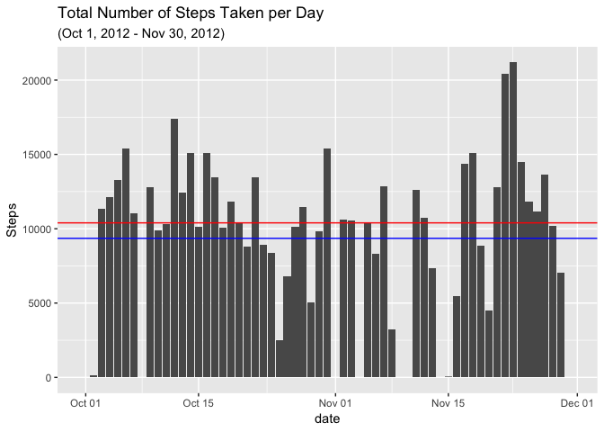
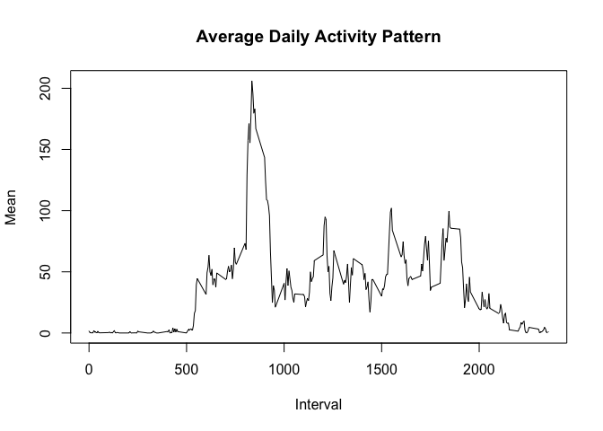
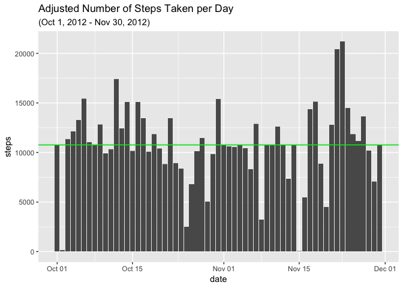
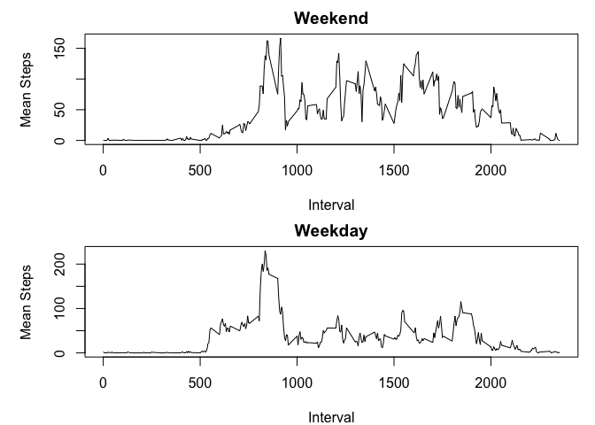

## Loading and preprocessing the data
First, read in the data.

```r
mydata<-read.csv("activity.csv",header = TRUE)
```
First, get a data frame that can easily be plotted

```r
totalstps<-with(mydata, tapply(steps, date, FUN = sum, na.rm = T))
asdf<-data.frame(date = names(totalstps), Steps = totalstps)
asdf$date<-as.Date(asdf$date)
```
All NA values were excluded from the dataset

Plotting the total number of steps taken each day:


```r
library(ggplot2)
library(scales)
g<-ggplot(asdf, aes(date, Steps))
g+geom_bar(stat = "identity")+geom_hline(aes(yintercept = mean(asdf$Steps)), color = "blue") +geom_hline(aes(yintercept = median(asdf$Steps)), color = "red")+labs(title = "Total Number of Steps Taken per Day", subtitle = "(Oct 1, 2012 - Nov 30, 2012)")
```

<!-- -->

In the graph above, the median is drawn in red and the mean is drawn in blue

## What is mean total number of steps taken per day?

Here's the mean and median (and other information)

```r
summary(asdf)
```

```
##       date                Steps      
##  Min.   :2012-10-01   Min.   :    0  
##  1st Qu.:2012-10-16   1st Qu.: 6778  
##  Median :2012-10-31   Median :10395  
##  Mean   :2012-10-31   Mean   : 9354  
##  3rd Qu.:2012-11-15   3rd Qu.:12811  
##  Max.   :2012-11-30   Max.   :21194
```

## What is the average daily activity pattern?

The data we will be using here is the mean of the steps taken across each of the time intervals

```r
meanstps<-with(mydata, tapply(steps, interval, FUN = mean, na.rm = T))
asdf<-data.frame(Interval = names(meanstps), "Mean" = meanstps)
asdf$Interval<-as.numeric(as.character(asdf$Interval))
```
Then to graph this as a time series plot

```r
plot(asdf, type = "l", main = "Average Daily Activity Pattern")
```

<!-- -->

Which 5-minute interval, on average across all the days in the dataset, contains the maximum number of steps?

```r
asdf[which.max(asdf$Mean),]
```

```
##     Interval     Mean
## 835      835 206.1698
```

We find that it is the 835 5 minute interval

## Imputing missing values

To find the total number of missing values

```r
sum(is.na(mydata))
```

```
## [1] 2304
```

```r
#just to check that the NAs appear only in the "steps" column
sum(is.na(mydata$steps))
```

```
## [1] 2304
```
For this plot, we will be using the mean number of steps for each time interval to fill in the NA values

Using dplyr, the data is grouped by interval


```r
library(dplyr)
```

```
## 
## Attaching package: 'dplyr'
```

```
## The following objects are masked from 'package:stats':
## 
##     filter, lag
```

```
## The following objects are masked from 'package:base':
## 
##     intersect, setdiff, setequal, union
```

```r
groupbyint<-group_by(mydata, interval)
```

Then, using the mean of each interval, we can fill in the missing values


```r
newdata<-mutate(groupbyint, mean = mean(steps, na.rm = TRUE))
newdata$steps[which(is.na(newdata$steps))]<-newdata$mean
```

```
## Warning in newdata$steps[which(is.na(newdata$steps))] <- newdata$mean:
## number of items to replace is not a multiple of replacement length
```

```r
head(newdata)
```

```
## # A tibble: 6 x 4
## # Groups:   interval [6]
##    steps date       interval   mean
##    <dbl> <fct>         <int>  <dbl>
## 1 1.72   2012-10-01        0 1.72  
## 2 0.340  2012-10-01        5 0.340 
## 3 0.132  2012-10-01       10 0.132 
## 4 0.151  2012-10-01       15 0.151 
## 5 0.0755 2012-10-01       20 0.0755
## 6 2.09   2012-10-01       25 2.09
```
Then plot the data


```r
newdata$date<-as.Date(newdata$date)
totalstps2<-with(newdata, tapply(steps, date, FUN = sum, na.rm =T))
g<-ggplot(newdata, aes(date, steps))
g+geom_bar(stat = "identity")+geom_hline(aes(yintercept = mean(totalstps2)), color = "blue") +geom_hline(aes(yintercept = median(totalstps2)), color = "green") +labs(title = "Adjusted Number of Steps Taken per Day", subtitle = "(Oct 1, 2012 - Nov 30, 2012)")
```

<!-- -->

In the above graph, the mean is drawn in blue and the median is drawn in green, but because they are the same value, only the median is showing.
Here's the mean and median (and other information) for the new data with the NAs replaced


```r
summary(totalstps2)
```

```
##    Min. 1st Qu.  Median    Mean 3rd Qu.    Max. 
##      41    9819   10766   10766   12811   21194
```

## Are there differences in activity patterns between weekdays and weekends?
First, a new factor variable is created in the dataset with two levels -- "weekday" and "weekend" indicating whether a given date is a weekday or weekend day.


```r
newdata1<-mutate(newdata, weekday = weekdays(date))
newdata1$day<-factor(newdata1$weekday, levels = c("Monday", "Tuesday", "Wednesday", "Thursday", "Friday", "Saturday", "Sunday"), labels = c("Weekday","Weekday","Weekday","Weekday","Weekday","Weekend", "Weekend"))
```

I couldn't figure out how to aggregate using the day as a factor so first I subsetted the data into two data frames. One for Weekday and one for Weekend.

```r
weekday<-subset(newdata1, day == "Weekday")
wdbyint<-aggregate(weekday$steps, list(weekday$interval), mean)
weekend<-subset(newdata1, day == "Weekend")
webyint<-aggregate(weekend$steps, list(weekend$interval), mean)
names(webyint)<-c("Interval", "Mean")
names(wdbyint)<-c("Interval", "Mean")
```

Here's the panel plot for the 5-minute interval and the average number of steps taken, averaged across all weekday days or weekend days.

```r
par(mfrow = c(2,1), mar = c(4,5,2,1))
plot(webyint, type = "l", main = "Weekend", ylab = "Mean Steps")
plot(wdbyint, type = "l", main = "Weekday", ylab = "Mean Steps")
```

<!-- -->

There's definitely a difference between activity patterns on weekdays and weekends
